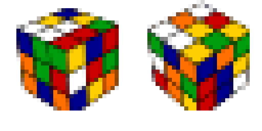
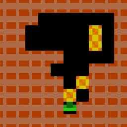
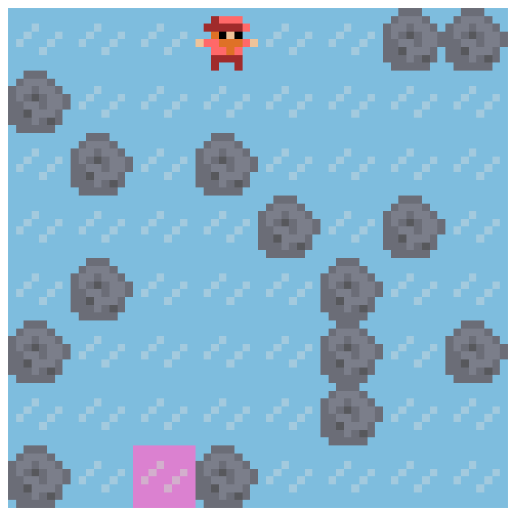
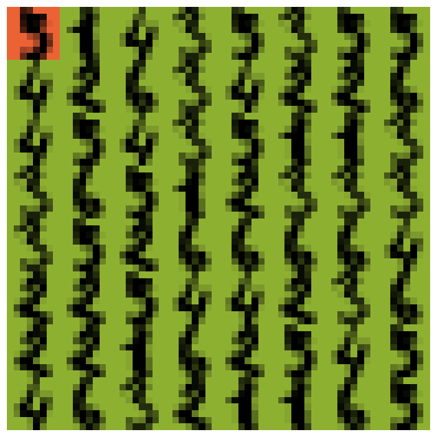
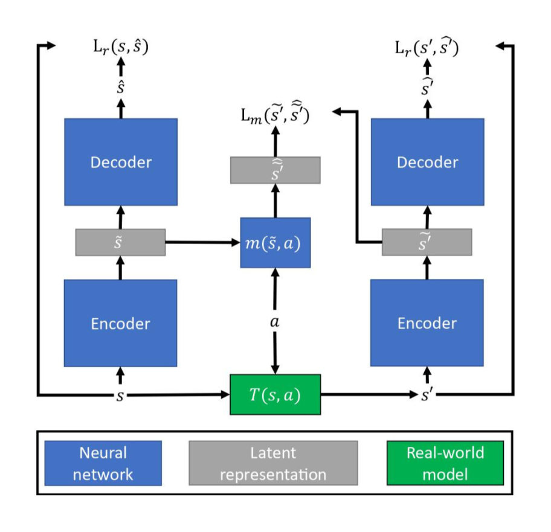

# DeepCubeAI

This repository contains the code and materials for the paper [Learning Discrete World Models for Heuristic Search](https://rlj.cs.umass.edu/2024/papers/Paper225.html)
> [!NOTE]  
> This README file is currently being updated and will include more details soon.
<br>

<div align="center">
   &nbsp; &nbsp;
   &nbsp; &nbsp;
   &nbsp; &nbsp;
   &nbsp; &nbsp;
</div>

## About DeepCubeAI

DeepCubeAI is an algorithm that learns a discrete world model and employs Deep Reinforcement Learning methods to learn a heuristic function that generalizes over start and goal states. We then integrate the learned model and the learned heuristic function with heuristic search, such as Q* search, to solve sequential decision making problems. For more details, read the [paper](https://rlj.cs.umass.edu/2024/papers/Paper225.html).
‌
### Key Contributions

DeepCubeAI is comprised of three key components:

1. **Discrete World Model**
   - Learns a world model that represents states in a discrete latent space.
   - This approach tackles two challenges: model degradation and state re-identification.
     - Prediction errors less than 0.5 are corrected by rounding.
     - Re-identifies states by comparing two binary vectors.
  
<div align="center">
  
</div>

2. **Generalizable Heuristic Function**
   - Utilizes Deep Q-Network (DQN) and hindsight experience replay (HER) to learn a heuristic function that generalizes over start and goal states.

3. **Optimized Search**
   - Integrates the learned model and the learned heuristic function with heuristic search to solve problems. It uses [Q* search](https://prl-theworkshop.github.io/prl2024-icaps/papers/9.pdf), a variant of A* search optimized for DQNs, which enables faster and more memory-efficient planning.
‌
### Main Results
* Accurate reconstruction of ground truth images after thousands of timesteps.
* Achieved 100% success on Rubik's Cube (canonical goal), Sokoban, IceSlider, and DigitJump.
* 99.9% success on Rubik's Cube with reversed start/goal states.
* Demonstrated significant improvement in solving complex planning problems and generalizing to unseen goals.

## Running the Code

To run the code, please follow these steps:

1. Create a Conda environment:
   - **For macOS:** Create an environment with dependencies specified in `environment_macos.yaml` using the following command:
     ```bash
     conda env create --file environment_macos.yaml
     ```
   - **For Linux and Windows:** Create an environment with dependencies specified in `environment.yaml` using the following command:
     ```bash
     conda env create --file environment.yaml
     ```

> [!NOTE]  
> The only difference between the macOS environment and the Linux/Windows environments is that `pytorch-cuda` is not installed for macOS, as CUDA is not available for macOS devices.

2. Run the setup script by executing `./setup.sh`

## Running the Code and Reproducing Results

The `reproduce_results` folder contains scripts to run the code. To run different stages of the code and reproduce the results in the paper, please use the corresponding `.sh` files in the `reproduce_results` folder. The code should be run in the order given by the commands inside `.sh` files.

Additionally, if you want to run the code on a machine with SLURM scheduler, you can use the job submission files in the `job_submissions` folder.